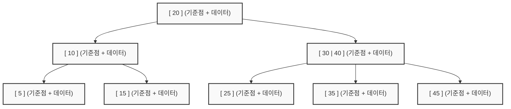
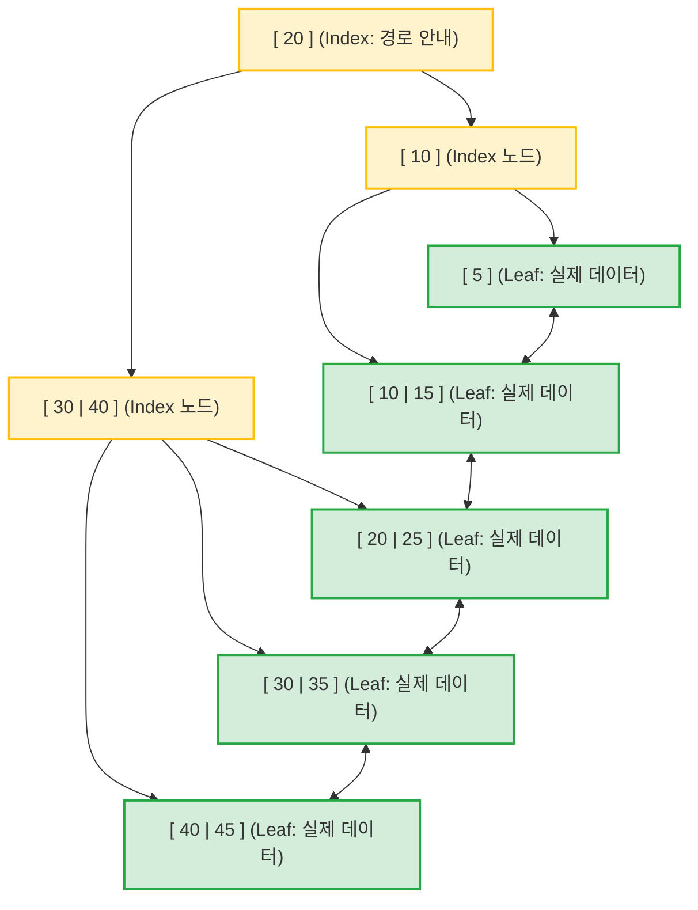

# [Algorithm Deep Dive] 이분탐색과 분할정복: 로그의 마법과 정복의 기술

> **"반으로 쪼개고, 결정을 내린다. 이것이 가장 빠른 지름길이다."**
> 데이터 규모가 수백만, 수십억 단위를 넘어설 때 선형 탐색은 무력해집니다. 탐색 범위를 반으로 줄여나가는 **이분탐색**과 큰 문제를 작은 단위로 해체하여 정복하는 **분할정복**에 대해 심층적으로 탐구합니다.

---

## 1. 이분탐색: 반으로 줄이는 로그의 기적

이분탐색은 정렬된 데이터 배열에서 특정한 값을 찾는 가장 효율적인 알고리즘입니다. 탐색 범위를 절반씩 줄여나가기 때문에 데이터가 아무리 방대해도 매우 빠르게 결과를 도출합니다.

### 🏛️ [역사적 배경] 전화번호부와 로그 함수

아날로그 시대, 수만 명의 이름이 적힌 두꺼운 전화번호부에서 특정 사람의 번호를 찾을 때 우리는 처음부터 한 장씩 넘기지 않습니다. 책의 중간을 펼치고, 이름 앞글자의 알파벳 순서를 비교한 뒤 앞부분을 볼지 뒷부분을 볼지 결정합니다. 이 직관적인 행위가 바로 이분탐색이며, 그 연산 횟수는 밑이 2인 로그를 따릅니다. 데이터가 10억 개라도 단 30번 남짓의 연산이면 충분합니다.

### 🛠️ [실전 심화 1] 직접 구현의 핵심: `while left <= right`

이분탐색을 직접 구현할 때 가장 많이 하는 실수는 반복문의 종료 조건과 범위 갱신 기준을 혼동하는 것입니다.

```python
def binary_search(arr, target):
    # 주의: 데이터는 반드시 정렬되어 있어야 합니다.
    left = 0
    right = len(arr) - 1

    while left <= right: # 등호가 들어가야 마지막에 남은 원소까지 검사합니다.
        mid = (left + right) // 2
    
        if arr[mid] == target:
            return mid # 값을 찾은 경우 인덱스 반환
        elif arr[mid] < target:
            left = mid + 1 # 찾는 값이 더 크면 오른쪽 절반 탐색
        else:
            right = mid - 1 # 찾는 값이 더 작으면 왼쪽 절반 탐색
        
    return -1 # 찾지 못한 경우
```

### 🛠️ [실전 심화 2] Python 최강의 무기: `bisect` 라이브러리

파이썬에는 이분탐색을 최적화하여 제공하는 내장 모듈 `bisect`가 있습니다. 배열에서 특정 값의 삽입 위치를 찾거나, 특정 범위에 속하는 원소의 개수를 셀 때 매우 강력합니다.

```python
from bisect import bisect_left, bisect_right

arr = [1, 2, 4, 4, 4, 6, 8]

# bisect_left: 값이 들어갈 수 있는 가장 왼쪽 위치를 찾습니다.
print(bisect_left(arr, 4)) # 결과: 2

# bisect_right: 값이 들어갈 수 있는 가장 오른쪽 위치를 찾습니다.
print(bisect_right(arr, 4)) # 결과: 5

# 🍯 꿀팁: 특정 값의 개수 구하기
print(bisect_right(arr, 4) - bisect_left(arr, 4)) # 5 - 2 = 3개
```

---

## 2. 파라메트릭 서치: 최적화에서 결정으로의 전환

파라메트릭 서치는 이분탐색의 응용 기법으로, 최적화 문제를 결정 문제로 바꾸어 푸는 마법 같은 기법입니다.

### 🏛️ [코딩 테스트 단골] 문제 유형 파악하기

* **"주어진 조건 하에서 최대값 또는 최소값을 구하시오."**
* 조건을 만족하는 값 $x$를 찾는 문제인데, $x$ 변화에 따라 조건 만족 여부가 `True`에서 `False`로 매끄럽게 변하는 단조성을 띠는 경우 사용합니다.
* 대표 문제: 랜선 자르기, 나무 자르기, 공유기 설치, 입국심사 등

### 🛠️ [실전 심화] 파라메트릭 서치 프레임워크 3단계

1. **결정 함수 설계하기**: 특정 값 $x$를 선택했을 때 문제 조건을 만족하는지 판단합니다 (`True` 또는 `False` 반환).
2. **범위 설정하기**: 가능한 최소값과 최대값으로 탐색 범위를 잡습니다.
3. **이분탐색으로 최적값 찾기**: 결정 함수의 결과에 따라 범위를 좁히며 정답을 갱신합니다.

```python
# [예시] N개의 랜선을 잘라 K개의 동일한 랜선을 만들 때 가능한 최대 길이
def check(length):
    count = 0
    for cable in cables:
        count += cable // length
    return count >= K # K개 이상 만들 수 있는지 판단

left = 1 
right = max(cables) 
answer = 0

while left <= right:
    mid = (left + right) // 2
  
    if check(mid): # 조건을 만족한다면
        answer = mid # 현재 값을 정답 후보로 기록
        left = mid + 1 # 더 긴 길이가 가능한지 확인
    else: # 조건을 만족하지 못한다면
        right = mid - 1 # 범위를 줄여 더 짧은 구간 탐색
```

> **핵심 논리**: 조건을 만족할 때마다 정답을 갱신해두면, 탐색이 끝났을 때 `answer`에 최적의 값이 남게 됩니다.

---

## 3. 분할 정복 심화 1: 병합 정렬

분할 정복은 큰 문제를 작은 부분 문제로 나누고 각각 해결한 뒤 결과를 모아 원래 문제를 해결하는 3단계 접근법입니다. 병합 정렬은 이 철학을 가장 잘 보여주는 예시입니다.

### 🏛️ [역사적 배경] 폰 노이만의 정렬

현대 컴퓨터 구조를 정립한 수학자 존 폰 노이만은 1945년에 병합 정렬을 고안했습니다. 쪼갤 때는 구조만 나누고 합칠 때 정렬을 수행하는 이 방식은 데이터 상태와 관계없이 일정한 성능을 보장하는 매우 안정적인 정렬 방식입니다.

### 🛠️ [실전 심화] 어떻게 합칠 것인가?

병합 정렬의 핵심은 재귀적으로 반씩 쪼개는 과정보다, 이미 정렬된 두 리스트를 하나의 정렬된 리스트로 합치는 병합 로직에 있습니다. 이때 투 포인터 기법이 사용됩니다.

```python
def merge_sort(arr):
    # 1. 기저 조건: 원소가 1개 이하이면 이미 정렬된 상태입니다.
    if len(arr) <= 1:
        return arr
  
    # 2. 분할: 중앙을 기준으로 반으로 나눕니다.
    mid = len(arr) // 2
    left_half = merge_sort(arr[:mid])
    right_half = merge_sort(arr[mid:])
  
    # 3. 결합: 두 리스트를 비교하며 하나로 합칩니다.
    merged = []
    l = r = 0
  
    while l < len(left_half) and r < len(right_half):
        if left_half[l] < right_half[r]:
            merged.append(left_half[l])
            l += 1
        else:
            merged.append(right_half[r])
            r += 1
        
    # 남은 원소들을 모두 추가합니다.
    merged.extend(left_half[l:])
    merged.extend(right_half[r:])
  
    return merged
```

> **성능 증명**: 데이터를 반으로 계속 쪼개므로 트리의 높이는 $\log N$이 됩니다. 각 층에서 병합할 때 모든 원소를 한 번씩 훑으므로 전체 시간 복잡도는 $O(N \log N)$이 됩니다.

---

## 4. 분할 정복 심화 2: 거듭제곱 분할

거듭제곱 연산 $C^N$을 단순히 $N$번 곱하면 $O(N)$ 시간이 걸립니다. $N$이 매우 클 때는 분할 정복 논리를 적용해 이를 $O(\log N)$으로 단축할 수 있습니다.

### 🛠️ [실전 심화 1] 절반으로 쪼개서 곱하기

지수 법칙을 활용하여 지수를 절반으로 나누어 계산합니다.

1. **$N$이 짝수일 때**: $C^N = C^{N/2} \times C^{N/2}$
2. **$N$이 홀수일 때**: $C^N = C^{(N-1)/2} \times C^{(N-1)/2} \times C$

```python
# A의 B제곱을 빠르게 계산하는 함수
def power(a, b):
    if b == 0:
        return 1
    if b == 1:
        return a
    
    x = power(a, b // 2)
  
    if b % 2 == 0:
        return x * x
    else:
        return x * x * a
```

### 🍯 [실전 심화 2] 나머지 연산과의 결합

코딩 테스트에서는 결과값이 너무 커지는 것을 방지하기 위해 특정 수로 나눈 나머지를 구하라는 조건이 자주 붙습니다. 이때는 연산 중간마다 나머지 연산을 적용해야 속도와 메모리를 효율적으로 관리할 수 있습니다.

```python
# 거듭제곱의 나머지를 구하는 실전 풀이
def power_mod(a, b, m):
    if b == 0:
        return 1 % m
    
    x = power_mod(a, b // 2, m)
  
    if b % 2 == 0:
        return (x * x) % m
    else:
        return (x * x % m) * a % m

# 사실 파이썬 내장 함수 pow(a, b, m)는 이 최적화가 이미 되어 있습니다.
print(pow(2, 10, 100)) # 결과: 24 (2^10을 100으로 나눈 나머지)
```

---

## 5. [부록] 데이터베이스 인덱스와 이분 탐색의 평행이론

알고리즘에서 배우는 이분 탐색 구조는 실제 서비스의 핵심인 데이터베이스 인덱스 아키텍처로 고스란히 이어집니다. 인덱스 표준인 B-Tree는 본질적으로 디스크 환경에 맞게 진화한 다중 분기 탐색 구조입니다.

### 🏛️ [인사이트] 왜 이진 탐색 트리를 데이터베이스에 쓰지 않을까?

* **물리적 구동의 한계**: 메모리는 전기적 신호로 접근하여 매우 빠르지만, 하드 디스크는 물리적인 이동이 필요하므로 수백만 배 느립니다.
* **트리 높이가 성능을 결정**: 자식이 2개뿐인 이진 탐색 트리로 10억 개의 데이터를 관리하면 깊이가 30단계에 달합니다. 값을 하나 찾으려면 디스크를 30번이나 읽어야 하는 성능 병목이 발생합니다.

### 🛠️ [실전 심화 1] 블록 단위 접근 전략

* 운영체제와 데이터베이스는 디스크에서 데이터를 읽을 때 항상 블록 또는 페이지라 불리는 단위로 왕창 읽어옵니다.
* 어차피 한 덩어리를 통째로 읽어올 거라면, 그 공간에 기준점을 최대한 많이 채워 넣어 한 번에 더 많은 범위를 걸러내는 것이 유리합니다.

### 🛠️ [실전 심화 2] B-Tree의 탄생: 낮고 넓은 구조

* B-Tree는 노드 크기를 디스크 블록 크기에 맞추고 수십에서 수백 개의 기준점을 채워 넣습니다.
* 자식이 수백 갈래로 늘어나면서 10억 개의 데이터도 단 3~4단계 깊이로 관리할 수 있게 됩니다. 디스크 읽기 횟수를 획기적으로 줄인 최적화의 결과물입니다.



### 🛠️ [실전 심화 3] B+Tree: 범위 탐색의 완성

현대 데이터베이스는 B-Tree를 개량한 B+Tree를 주로 사용하며 두 가지 핵심 진화를 이루었습니다.

* **데이터는 리프 노드에만 저장**: 중간 노드에는 경로 안내를 위한 키만 저장하여 공간을 확보합니다. 덕분에 더 많은 가지를 쳐서 트리를 더 낮게 유지할 수 있습니다.
* **리프 노드 간 연결 리스트 구조**: 가장 아래 노드들을 서로 연결해 두었습니다. 덕분에 특정 범위의 데이터를 연속해서 읽어야 할 때 트리를 오르내릴 필요 없이 옆으로 이동하며 빠르게 데이터를 스캔할 수 있습니다.


